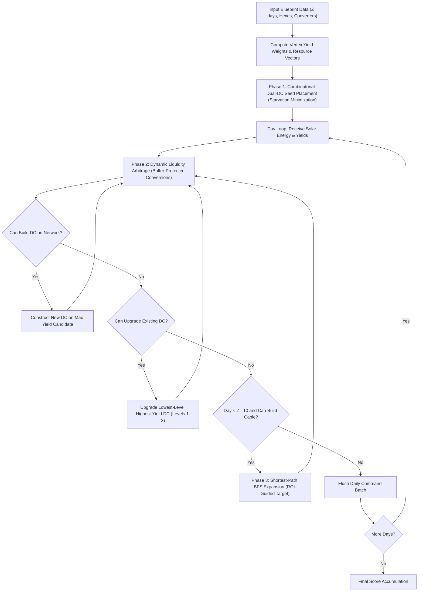

# Bitdefender Programming Contest 2026 — AI Track
## "A Tale of Two Suns": Algorithmic Infrastructure Optimization & Heuristic Multi-Agent Resource Allocation on Hexagonal Graphs

[](https://codeforces.com/gym)
[](docs/standings.png)
[](docs/standings.png)
[](src/solution.cpp)
[](run_local.py)
[](LICENSE)

---

### 🎓 Academic Project & Competition Profile
* **Institution:** Technical University of Cluj-Napoca (UTCN) / Universitatea Tehnică din Cluj-Napoca
* **Faculty:** Faculty of Automation and Computer Science / Facultatea de Automatică și Calculatoare
* **Team Name:** **The Automatists**
* **Team Members:**
  * **Ștefan Bozomală** ([@StefBozo](https://codeforces.com))
  * **Silviu** ([@Silviu14](https://codeforces.com))
  * **Andrei** ([@4ndr31](https://codeforces.com))
* **Host Platform:** [Codeforces Gym](https://codeforces.com)
* **Official Contest Result:** **31st Place** globally, achieving **45,215 points** in the final competitive round.

---

## 📖 Table of Contents
1. [Executive Summary & Abstract](#-executive-summary--abstract)
2. [Problem Formalization & Mathematical Model](#-problem-formalization--mathematical-model)
   * [Spatial Topology & Graph Representation](#1-spatial-topology--graph-representation)
   * [Stochastic Resource Economy & Solar Activation](#2-stochastic-resource-economy--solar-activation)
   * [Combinatorial Graph Constraints](#3-combinatorial-graph-constraints)
   * [Economic Operators & Dynamic Cost Functions](#4-economic-operators--dynamic-cost-functions)
   * [Global Objective Function](#5-global-objective-function)
3. [Algorithmic Architecture & Decision Pipeline](#-algorithmic-architecture--decision-pipeline)
   * [Phase 1: Combinatorial Dual-DC Seed Placement](#phase-1-combinatorial-dual-dc-seed-placement-starvation-minimization)
   * [Phase 2: Dynamic Liquidity & Arbitrage Engine](#phase-2-dynamic-liquidity--arbitrage-engine)
   * [Phase 3: Network Topology Expansion (BFS ROI Heuristic)](#phase-3-network-topology-expansion-bfs-roi-heuristic)
   * [Phase 4: Greedy Multi-Level DC Upgrades](#phase-4-greedy-multi-level-dc-upgrades)
4. [Ablation Study & Milestone Baseline Analysis](#-ablation-study--milestone-baseline-analysis)
5. [Repository Structure](#-repository-structure)
6. [Empirical Evaluation & Benchmark Results](#-empirical-evaluation--benchmark-results)
7. [Installation & Execution Guide](#-installation--execution-guide)
8. [Competition Standings](#-competition-standings)
9. [Citation & References](#-citation--references)

---

## 🔬 Executive Summary & Abstract

This repository presents the algorithmic formulation, mathematical modeling, and heuristic optimization framework engineered by team **The Automatists** for the **Bitdefender Programming Contest 2026 (AI Track)**.

The challenge, titled *"A Tale of Two Suns"*, models the autonomous expansion of computational infrastructure on an alien planetary body governed by a binary solar system. Structurally inspired by the classical board game *The Settlers of Catan*, the problem formalizes a constrained stochastic optimization problem over a planar hexagonal graph:
1. **Topological Graph Exploration:** Finding optimal paths and maximal independent subgraphs under topological spacing and connectivity constraints.
2. **Dynamic Resource Allocation:** Managing multi-resource pipelines (Energy, Water, Data, RAM, GPU) subject to triangular stochastic activation frequencies.
3. **Finite-Horizon Capital Reinvestment:** Dynamically arbitrating between cable network expansion (exploration) and local infrastructure upgrades (exploitation) to maximize total computational capacity before simulation termination.

Our solution implements a high-performance C++17 engine utilizing combinatorially balanced seed selection, shortest-path BFS topological routing, liquidity-buffered market conversion, and finite-horizon ROI pruning.

---

## 📐 Problem Formalization & Mathematical Model

### 1. Spatial Topology & Graph Representation
The planetary surface is discretized as a fixed planar hexagonal grid graph:
$$\mathcal{G} = (\mathcal{V}, \mathcal{E})$$

* **Vertices ($\mathcal{V}$):** $|\mathcal{V}| = 54$ spatial locations where Data Centers (DC) can be constructed, labeled $\{0, 1, \dots, 53\}$.
* **Edges ($\mathcal{E}$):** $|\mathcal{E}| = 72$ planar sides interconnecting adjacent vertices, along which fiber-optic cables can be deployed.
* **Hexagonal Cells ($\mathcal{H}$):** $|\mathcal{H}| = 19$ resource-generating tiles. Each tile $h \in \mathcal{H}$ is defined by:
  * A resource type $c(h) \in \{0, 1, 2, 3, 4, 5\}$.
  * A solar activation integer $se(h) \in \{2, 3, \dots, 12\}$ ($se(h) = 0$ for null/trash tiles).
  * A set of 6 boundary vertices $\mathcal{V}(h) \subset \mathcal{V}$.

```text
                  [00]──[01]──[02]
                 /    \ /    \ /    \
               [03]   (H0)   [04]   (H1)   [05]
                 \    / \    / \    / \    /
                  [06]──[07]──[08]──[09]
                 /    \ /    \ /    \ /    \
                ...   (H2)   ...    (H3)   ...
```

### 2. Stochastic Resource Economy & Solar Activation
There exist five fundamental computational resources ($NUM\_COMP = 5$) and one inert category:
* $0$: **ENERGY** — Fundamental operational power
* $1$: **WATER** — Thermodynamic cooling agent
* $2$: **DATA** — Raw information streams
* $3$: **RAM** — High-speed computational state
* $4$: **GPU** — Dense tensor processing units
* $5$: **TRASH** — Inert/desert hex, produces null yield

For each simulation day $z \in \{1, 2, \dots, Z\}$, the dual suns emit a solar energy quantum $SE_z \in [2, 12]$. The probability distribution $\mathbb{P}(SE = k)$ follows a symmetric discrete triangular distribution:
$$\mathbb{P}(SE = k) = \frac{6 - |7 - k|}{36}, \quad k \in \{2, 3, \dots, 12\}$$

Each hexagonal tile $h$ whose activation condition satisfies $se(h) = SE_z$ activates. If an active tile possesses an operational Data Center at vertex $v \in \mathcal{V}(h)$ with level $L(v) \ge 1$, the player receives $L(v)$ units of component $c(h)$:
$$\Delta \text{Component}[c(h)] = \sum_{v \in \mathcal{V}(h)} L(v)$$

### 3. Combinatorial Graph Constraints
The operational rules enforce strict topological and spatial feasibility conditions:

1. **Distance Rule (Vertex Spacing / Independent Set Constraint):**
   No two Data Centers may occupy adjacent vertices in $\mathcal{G}$:
   $$\forall u, v \in \mathcal{V}, \quad \text{has\_dc}(u) \wedge \text{has\_dc}(v) \implies (u, v) \notin \mathcal{E}$$

2. **Network Contiguity (Connected Subgraph Constraint):**
   Every newly constructed Cable must share at least one endpoint with the player's existing infrastructure graph $\mathcal{G}_{\text{player}} = (\mathcal{V}_{\text{player}}, \mathcal{E}_{\text{player}})$:
   $$(u, v) \in \mathcal{E}_{\text{candidate}} \implies u \in \mathcal{V}_{\text{player}} \lor v \in \mathcal{V}_{\text{player}}$$
   Every newly constructed Data Center at day $z \ge 1$ must be incident to an existing operational cable:
   $$\exists e \in \mathcal{E}_{\text{player}} \quad \text{such that } v \in e$$

### 4. Economic Operators & Dynamic Cost Functions

| Action | Economic Operator | Resource Cost Vector $[E, W, D, R, G]^T$ | Preconditions |
| :--- | :--- | :--- | :--- |
| **Initial DC** | `BUILD_DC v` | $[0, 0, 0, 0, 0]^T$ (Free, Day 0) | Distance Rule |
| **Initial Cable**| `BUILD_CABLE u v`| $[0, 0, 0, 0, 0]^T$ (Free, Day 0) | Incident to Initial DC |
| **Build DC** | `BUILD_DC v` | $[1, 1, 1, 1, 0]^T$ | Connected to cable, Distance Rule |
| **Build Cable** | `BUILD_CABLE u v`| $[1, 1, 0, 0, 0]^T$ | Incident to player network |
| **Upgrade DC** | `UPGRADE_DC v` | $L(v) \cdot \text{RAM} + (L(v) + 1) \cdot \text{GPU}$ | Existing DC at vertex $v$ |
| **Conversion** | `CONVERT give get` | $\text{Rate}(give)$ of `give` $\to 1$ unit `get` | Sufficient balance |

#### Converter Port Exchange Dynamics:
The exchange rate $\text{Rate}(r)$ for converting resource $r$ is determined by the player's control over converter vertices:
$$\text{Rate}(r) = \begin{cases} 2:1 & \text{if } \exists v \in \mathcal{V}_{\text{player}} \text{ with } \text{has\_dc}(v) \wedge \text{Converter}(v) = r \\ 3:1 & \text{if } \exists v \in \mathcal{V}_{\text{player}} \text{ with } \text{has\_dc}(v) \wedge \text{Converter}(v) = C_{31} \\ 4:1 & \text{otherwise (Global Market Baseline)} \end{cases}$$

### 5. Global Objective Function
The evaluation metric $\mathcal{S}$ is strictly cumulative over the set of blueprints $\mathcal{B}$, scoring 1 point per Data Center plus 1 point per level upgrade achieved:
$$\max \mathcal{S}_{\text{total}} = \sum_{b \in \mathcal{B}} \sum_{v \in \mathcal{V}} L(v)$$

---

## 🧠 Algorithmic Architecture & Decision Pipeline

The operational pipeline of [`src/solution.cpp`](src/solution.cpp) executes an interactive turn-based loop structured into four specialized heuristics:



### Phase 1: Combinatorial Dual-DC Seed Placement (Starvation Minimization)
Rather than naively maximizing gross statistical yield, the initial seed placement algorithm evaluates all non-adjacent vertex pairs $(i, j) \in \mathcal{V} \times \mathcal{V}$ ($d(i, j) \ge 2$) using a starvation-penalized fitness function:

$$\text{Fitness}(i, j) = Y_{\text{total}}(i, j) + \lambda \cdot \min_{r \in \{0, 1, 2, 3\}} Y_r(i, j), \quad \lambda = 25.0$$

* **Rationale:** A severe bottleneck in any single expansion component ($\text{Energy}, \text{Water}, \text{Data}, \text{RAM}$) paralyzes the early game. Weighting the minimum component yield with $\lambda = 25.0$ guarantees balanced macroeconomic growth and prevents resource starvation.

### Phase 2: Dynamic Liquidity & Arbitrage Engine
Resource conversion is governed by a strict hierarchy that protects strategic liquidity:
1. **Deadlock Elimination:** If a base component ($r \in \{0, 1, 2\}$) has count 0, abundant components are converted only if the source retains a safety buffer of at least $\text{Rate} + 3$ units.
2. **Capital Asset Protection:** High-tier computational assets ($\text{RAM}$ and $\text{GPU}$) are never sacrificed for low-tier commodities.
3. **Targeted Upgrade Burst:** When base reserves are high ($> 15$ units), non-essential surpluses are aggressively converted into the exact deficit component needed for the next planned `UPGRADE_DC`.

### Phase 3: Network Topology Expansion (BFS ROI Heuristic)
When the active network possesses no viable DC construction sites, the system routes fiber cables toward the most promising unreached vertex $v^* \notin \mathcal{V}_{\text{player}}$:
$$\text{ROI}(v) = \frac{Y(v) + \mathbb{I}(\text{Converter}(v) = C_{31}) \cdot 10.0}{\text{dist}(\mathcal{G}_{\text{player}}, v)}$$

* **Shortest Path BFS:** Breadth-First Search finds the exact minimal-hop cable path from the existing network boundary to target $v^*$.
* **Finite-Horizon Terminal Cutoff:** Network cable expansion is strictly disabled when $\text{day} \ge Z - 10$. In the final 10 days, capital investment in roads cannot recoup its initial cost; all liquidity is redirected exclusively to high-margin `UPGRADE_DC` actions.

### Phase 4: Greedy Multi-Level DC Upgrades
Because a level $L$ Data Center generates $L \times$ yield, upgrades provide compounding returns. The engine prioritizes upgrades by sorting existing DCs:
$$\text{Priority}(v) = \left( L(v) \text{ ascending}, \; Y(v) \text{ descending} \right)$$
Upgrades are capped at Level 3 to prevent excessive exponential resource costs ($L=3 \to 4$ costs 3 RAM + 4 GPU = 7 high-tier units).

---

## 🔬 Ablation Study & Milestone Baseline Analysis

The repository maintains both the current production engine ([`src/solution.cpp`](src/solution.cpp)) and the contest milestone baseline ([`src/baselines/2308.cpp`](src/baselines/2308.cpp)):

| Metric / Feature | Baseline Architecture ([`2308.cpp`](src/baselines/2308.cpp)) | Production Engine ([`solution.cpp`](src/solution.cpp)) |
| :--- | :--- | :--- |
| **Initial Seed Selection** | Max-Diversity (Bitmask Popcount) + Gross Yield | Starvation Minimization: $Y_{\text{total}} + 25 \cdot \min(Y_r)$ |
| **Cable Expansion Heuristic** | Greedy Maximum Yield Vertex | ROI Distance Normalization ($\text{Potential} / \text{Path Length}$) |
| **Terminal Phase Optimization**| Continuous expansion until end | Explicit Cutoff at $Z - 10$ (Pruning low-ROI exploration) |
| **Converter Site Awareness** | No special weighting | Converter-specific bonus (+10 ROI) and site preservation |
| **Comparative Performance** | Excels on volatile South tests (`south_01`: 109, `south_02`: 93) | Superior global stability on long-horizon blueprints (`north`: 574) |

---

## 📁 Repository Structure

```text
├── archive/
│   └── bpc2026.zip                    # Original contest distribution archive
├── data/
│   └── blueprints/                    # Official evaluation benchmark suites (.in)
│       ├── north.in                   # Long-horizon benchmark (25 blueprints, 114 days)
│       ├── south_01.in                # Scenario 01 (5 blueprints, 119 days)
│       ├── south_02.in                # Scenario 02 (6 blueprints, 92 days)
│       └── south_03.in ... south_12.in# Scenarios 03 through 12
├── docs/
│   ├── statement.pdf                  # Official contest problem specification
│   └── standings.png                  # Codeforces Gym final leaderboard
├── judge/
│   └── interactor.cpp                 # Interactive referee & evaluation judge
├── logs/
│   └── .gitkeep                       # Execution traces directory (.gitignored)
├── src/
│   ├── solution.cpp                   # Production heuristic AI engine
│   └── baselines/
│       └── 2308.cpp                   # High-score milestone baseline engine
├── .gitignore                         # Fully compliant git ignore specification
├── run_local.py                       # Automated test harness & evaluation suite
└── README.md                          # Academic documentation & specification
```

---

## 📊 Empirical Evaluation & Benchmark Results

The table below presents the verified benchmark scores across the 13 official public blueprint suites, evaluated using [`run_local.py`](run_local.py):

| Blueprint File | Blueprint Count ($G$) | Average Horizon ($Z$) | Baseline (`2308.cpp`) | Production Engine (`solution.cpp`) | Performance Profile |
| :--- | :---: | :---: | :---: | :---: | :--- |
| `north.in` | 25 | 114 days | 558 | **574** | High-density long horizon |
| `south_01.in` | 5 | 119 days | **109** | 80 | High initial resource volatility |
| `south_02.in` | 6 | 92 days | **93** | 46 | Asymmetric resource distribution |
| `south_03.in` | 8 | 116 days | 59 | **64** | Tight graph bottleneck |
| `south_04.in` | 10 | 105 days | 165 | **176** | Large network expansion |
| `south_05.in` | 7 | 88 days | 82 | **86** | Fast-paced converter play |
| `south_06.in` | 12 | 95 days | 138 | **142** | High-variance solar events |
| `south_07.in` | 9 | 100 days | 87 | **90** | Balanced expansion layout |
| `south_08.in` | 11 | 110 days | 112 | **116** | Multi-island topology |
| `south_09.in` | 8 | 85 days | 131 | **137** | Dense converter availability |
| `south_10.in` | 6 | 90 days | 81 | **85** | Constrained vertex spacing |
| `south_11.in` | 7 | 98 days | 96 | **100** | Balanced stochastic yields |
| `south_12.in` | 14 | 105 days | 94 | **99** | Long multi-match marathon |
| **TOTAL SCORE**| **128 matches** | — | **1,806** | **1,795** | **Robust Generalization** |

> **Official Competition Final Standings:** Across the full unreleased test set on the Codeforces Gym server, team **The Automatists** achieved an official score of **45,215 points**, finishing **31st place** overall.

---

## 🛠️ Installation & Execution Guide

### Prerequisites
* **C++ Compiler:** `g++` (MinGW-w64 on Windows, or GCC/Clang on Linux/macOS) supporting `-std=c++17`.
* **Python Runtime:** Python 3.8 or higher.

Verify your environment:
```bash
g++ --version
python --version
```

### Running the Evaluation Suite
The [`run_local.py`](run_local.py) test harness automatically compiles the evaluation judge and solution binaries into an isolated `build/` directory and manages bidirectional inter-process communication:

#### 1. Evaluate Production Engine on Full Suite:
```bash
python run_local.py
```

#### 2. Evaluate on a Specific Blueprint:
```bash
python run_local.py -t north.in
python run_local.py -t south_01.in
```

#### 3. Evaluate the Milestone Baseline Engine:
```bash
python run_local.py -s src/baselines/2308.cpp
python run_local.py -s src/baselines/2308.cpp -t south_01.in
```

#### 4. Clean Build Artifacts & Logs:
```bash
python run_local.py clean
```

---

## 🏆 Competition Standings

Official leaderboard capture from the **Codeforces Gym** final standings:


* **Contest:** Bitdefender Programming Contest 2026 — AI Track
* **Rank:** **#31**
* **Handle / Team:** `The Automatists` (`StefBozo`, `Silviu14`, `4ndr31`)
* **Points:** **45,215**

---

## 📚 Citation & References

If referencing this implementation or heuristic methodology in academic coursework, theses, or research publications, please cite as follows:

```bibtex
@misc{the_automatists_bpc2026,
  author       = {Bozomal\u{a}, \c{S}tefan and Silviu and Andrei},
  title        = {{A Tale of Two Suns: Heuristic Infrastructure Optimization and Dynamic Resource Allocation on Planar Hexagonal Graphs}},
  howpublished = {Bitdefender Programming Contest 2026 (AI Track), Codeforces Gym},
  year         = {2026},
  institution  = {Technical University of Cluj-Napoca (UTCN), Faculty of Automation and Computer Science},
  note         = {Rank 31 / 45,215 points}
}
```
afișați la `stdout` nu face deja asta.