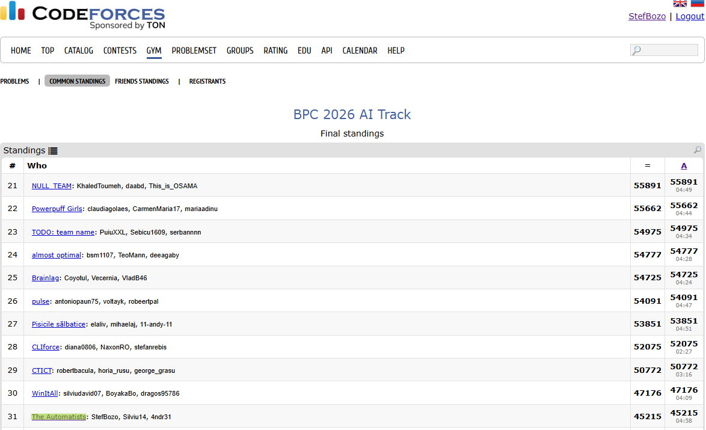

# Bitdefender Programming Contest 2026 — AI Track
### "A Tale of Two Suns"

> **Team:** The Automatists — *StefBozo, Silviu14, 4ndr31* (UTCN, Faculty of CS & Automation)
> **Final Result:** 🥉 **31st place / 45,215 points** on [Codeforces Gym](https://codeforces.com/gym)

---

## What's this about?

This is our team's solution for the BPC 2026 AI Track — an interactive competitive programming problem where you build and expand a server infrastructure on a hexagonal Catan-like map.

Each round you receive 5 types of resources (Energy, Water, Data, RAM, GPU) based on a dice-roll-like solar energy system. You spend them to:
- **Build Data Centers** on map vertices
- **Lay cables** to expand your network
- **Upgrade DCs** to produce more resources per turn
- **Convert** surplus resources into what you actually need

Your score = the total sum of all DC levels achieved by the end of the game.

The problem includes a local judge (`judge/interactor.cpp`) that simulates the game. Your solution talks to it via `stdin`/`stdout`.

---

## Repo Structure

```
├── src/
│   ├── solution.cpp          ← main submission (current best)
│   └── baselines/
│       └── 2308.cpp          ← older version kept for comparison
├── judge/
│   └── interactor.cpp        ← the local judge (provided by Bitdefender)
├── data/
│   └── blueprints/           ← all 13 test maps (.in files)
│       ├── north.in          ← big map, 25 blueprints
│       ├── south_01.in
│       └── south_02.in ... south_12.in
├── docs/
│   ├── statement.pdf         ← full problem statement
│   └── standings.png         ← final leaderboard screenshot
├── archive/
│   └── bpc2026.zip           ← original contest zip
├── logs/                     ← interaction logs generated during runs
├── run_local.py              ← test runner script
└── .gitignore
```

---

## Running Locally

### Requirements
- `g++` with C++17 support (MinGW-w64 on Windows, GCC/Clang on Linux/macOS)
- Python 3.8+

```bash
g++ --version
python --version
```

### Run on all maps:
```bash
python run_local.py
```

### Run on a single map:
```bash
python run_local.py -t south_01.in
python run_local.py -t north.in
```

### Test a different solution file:
```bash
python run_local.py -s src/baselines/2308.cpp
python run_local.py -s src/baselines/2308.cpp -t south_01.in
```

### Clean compiled binaries and logs:
```bash
python run_local.py clean
```

The script auto-compiles both the judge and the solution into a `build/` folder (ignored by git), then runs them together, piping their I/O.

---

## How Our Solution Works

### 1. Initial placement
We pick the 2 starting DCs using a score that heavily rewards balanced resource access rather than just raw total yield:

```
score(i, j) = total_yield(i, j) + 25 × min_resource_yield(i, j)
```

This avoids the common early failure where one resource is completely missing and you can't build anything.

### 2. Daily decision loop
Each day, in order of priority:
1. **Convert** resources if something is at 0 and you have a surplus somewhere else (with safety buffers to avoid draining yourself dry)
2. **Build a DC** on the best available network node
3. **Upgrade a DC** — lowest level first, highest yield first
4. **Extend the cable network** toward the highest ROI unreached node:
   ```
   ROI(node) = (yield + converter_bonus) / distance_from_network
   ```
5. **Stop expanding cables** in the last 10 days — cables cost resources that won't pay off in time

### 3. The baseline (`2308.cpp`)
An older version that used diversity-first seeding and simpler expansion logic. It scores better on some short/volatile maps but worse overall. Kept as a reference.

---

## Benchmark Results

Scores on the 13 public test maps:

| Map | `solution.cpp` | `2308.cpp` (baseline) |
|---|:---:|:---:|
| `north.in` | **574** | 558 |
| `south_01.in` | 80 | **109** |
| `south_02.in` | 46 | **93** |
| `south_03.in` | **64** | 59 |
| `south_04.in` | **176** | 165 |
| `south_05.in` | **86** | 82 |
| `south_06.in` | **142** | 138 |
| `south_07.in` | **90** | 87 |
| `south_08.in` | **116** | 112 |
| `south_09.in` | **137** | 131 |
| `south_10.in` | **85** | 81 |
| `south_11.in` | **100** | 96 |
| `south_12.in` | **99** | 94 |
| **Total** | **1,795** | 1,806 |

> The baseline wins on `south_01` and `south_02` — both have high early variance where the diversity-first seeding pays off. Production engine is better overall.

Official score on the full private test set: **45,215 pts, Rank #31**.



---

## Languages Supported by the Judge

| Language | Compiler | Flags |
|---|---|---|
| C++ | `g++` / `clang++` | `-std=c++17 -O2` |
| C | `gcc` / `clang` | `-std=c11 -O2` |
| Python | `python3` | `-u` |
| Java | `javac` + `java` | — |
| Rust | `rustc` | `-O` |
